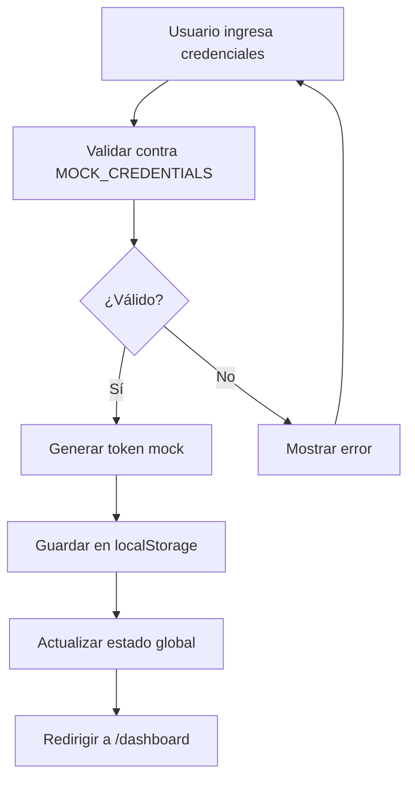

# MicroGreens System - Architecture Guide

## 🏛️ Arquitectura General

```
┌─────────────────┐    HTTP    ┌─────────────────┐    SQL     ┌─────────────┐
│   Frontend      │  ◄────────► │    Backend      │  ◄────────► │  Database   │
│   Next.js 15    │   REST API  │   Express.js    │  Sequelize  │ PostgreSQL  │
│   TypeScript    │             │   Node.js       │             │   (Neon)    │
└─────────────────┘             └─────────────────┘             └─────────────┘
```

## 📂 Estructura del Proyecto (Actual)

```
MicroGreens/
├── app/
│   ├── (auth)/                   # Route group para autenticación
│   │   ├── login/
│   │   │   └── page.tsx          # Página de login
│   │   └── layout.tsx            # Layout para páginas de auth
│   ├── (dashboard)/              # Route group para dashboard
│   │   ├── dashboard/
│   │   │   └── page.tsx          # Dashboard principal
│   │   ├── siembras/
│   │   │   ├── page.tsx          # Lista de siembras
│   │   │   ├── nueva/page.tsx    # Crear siembra
│   │   │   └── [id]/page.tsx     # Detalle de siembra
│   │   ├── cosechas/
│   │   │   ├── page.tsx          # Lista de cosechas
│   │   │   └── nueva/page.tsx    # Registrar cosecha
│   │   ├── estadisticas/
│   │   │   └── page.tsx          # Estadísticas y gráficos
│   │   └── layout.tsx            # Layout para dashboard
│   ├── api/                      # API Routes (opcional para mock)
│   │   ├── auth/
│   │   │   └── route.ts          # Mock auth endpoint
│   │   └── mock/
│   │       ├── siembras/route.ts # Mock siembras data
│   │       └── cosechas/route.ts # Mock cosechas data
│   ├── globals.css               # Estilos globales
│   └── layout.tsx                # Root layout
├── components/
│   ├── auth/
│   │   └── LoginForm.tsx         # Formulario de login
│   ├── dashboard/
│   │   ├── StatsCard.tsx         # Tarjetas de estadísticas
│   │   ├── RecentActivity.tsx    # Actividad reciente
│   │   └── QuickActions.tsx      # Acciones rápidas
│   ├── siembras/
│   │   ├── SiembraForm.tsx       # Formulario de siembra
│   │   ├── SiembraCard.tsx       # Tarjeta de siembra
│   │   └── SiembrasList.tsx      # Lista de siembras
│   ├── cosechas/
│   │   ├── CosechaForm.tsx       # Formulario de cosecha
│   │   └── CosechasList.tsx      # Lista de cosechas
│   ├── charts/
│   │   ├── ProductionChart.tsx   # Gráfico de producción
│   │   └── YieldChart.tsx        # Gráfico de rendimiento
│   ├── layout/
│   │   ├── Header.tsx            # Header con navegación
│   │   ├── Sidebar.tsx           # Sidebar de navegación
│   │   └── Footer.tsx            # Footer
│   └── ui/                       # shadcn/ui components (ya existe)
├── lib/
│   ├── api.ts                    # Cliente HTTP
│   ├── auth.ts                   # Lógica de autenticación
│   ├── types.ts                  # Tipos TypeScript
│   ├── constants.ts              # Constantes del proyecto
│   └── utils.ts                  # Utilidades (ya existe)
├── hooks/
│   ├── useAuth.ts                # Hook de autenticación
│   ├── useSiembras.ts            # Hook para siembras
│   └── useCosechas.ts            # Hook para cosechas
└── providers/
    └── AuthProvider.tsx          # Context de autenticación
```

## 🔐 Sistema de Autenticación Mockeado

### 1. Credenciales Mock
```typescript
// lib/auth.ts
export const MOCK_CREDENTIALS = {
  email: 'admin@microgreens.com',
  password: 'admin123'
}

export const MOCK_USER = {
  id: '1',
  email: 'admin@microgreens.com',
  name: 'Administrador',
  role: 'admin',
  avatar: '/placeholder-user.jpg'
}
```

### 2. AuthProvider (React Context)
```typescript
// providers/AuthProvider.tsx
interface User {
  id: string;
  email: string;
  name: string;
  role: string;
  avatar: string;
}

interface AuthContextType {
  user: User | null;
  login: (email: string, password: string) => Promise<void>;
  logout: () => void;
  isLoading: boolean;
  isAuthenticated: boolean;
}
```

### 3. Flujo de Autenticación


### 4. Protección de Rutas
```typescript
// middleware.ts (Next.js middleware)
export function middleware(request: NextRequest) {
  const token = request.cookies.get('auth-token')?.value
  
  if (request.nextUrl.pathname.startsWith('/dashboard') && !token) {
    return NextResponse.redirect(new URL('/login', request.url))
  }
  
  if (request.nextUrl.pathname === '/login' && token) {
    return NextResponse.redirect(new URL('/dashboard', request.url))
  }
}
```

## 📊 Modelos de Datos

### Tipos TypeScript
```typescript
// lib/types.ts
export interface Siembra {
  id: string;
  tipo_microgreen: 'brócoli' | 'rábano' | 'girasol' | 'guisante' | 'rúcula' | 'amaranto';
  fecha_siembra: string;
  cantidad_sembrada: number; // gramos de semilla
  ubicacion_bandeja: string; // 'A1', 'B2', etc.
  fecha_esperada_cosecha: string;
  fecha_real_cosecha?: string;
  estado: 'sembrado' | 'creciendo' | 'listo' | 'cosechado';
  notas?: string;
  created_at: string;
  updated_at: string;
}

export interface Cosecha {
  id: string;
  siembra_id: string;
  fecha_cosecha: string;
  peso_cosechado: number; // gramos
  calidad: 1 | 2 | 3 | 4 | 5; // estrellas
  notas?: string;
  created_at: string;
}

export interface EstadisticasDashboard {
  siembras_activas: number;
  cosechas_mes: number;
  peso_total_mes: number;
  rendimiento_promedio: number;
  proximas_cosechas: Siembra[];
  produccion_por_tipo: {
    tipo: string;
    cantidad: number;
    peso_total: number;
  }[];
}
```

## 🎨 Configuración Tailwind v4

### Instalación y Configuración
```bash
# Actualizar a Tailwind v4
npm install tailwindcss@next @tailwindcss/vite@next
```

```typescript
// tailwind.config.ts
import type { Config } from 'tailwindcss'

const config: Config = {
  content: [
    './app/**/*.{js,ts,jsx,tsx,mdx}',
    './components/**/*.{js,ts,jsx,tsx,mdx}',
  ],
  theme: {
    extend: {
      colors: {
        // Paleta para microgreens
        primary: {
          50: '#f0fdf4',
          100: '#dcfce7',
          200: '#bbf7d0',
          300: '#86efac',
          400: '#4ade80',
          500: '#22c55e', // Verde principal
          600: '#16a34a',
          700: '#15803d',
          800: '#166534',
          900: '#14532d',
        },
        // Estados de siembras
        status: {
          sembrado: '#f59e0b', // Amarillo
          creciendo: '#3b82f6', // Azul
          listo: '#22c55e', // Verde
          cosechado: '#6b7280', // Gris
        }
      },
      fontFamily: {
        sans: ['Inter', 'system-ui', 'sans-serif'],
      },
      animation: {
        'fade-in': 'fadeIn 0.5s ease-in-out',
        'slide-up': 'slideUp 0.3s ease-out',
      }
    },
  },
  plugins: [],
}

export default config
```

## 🚀 API Endpoints (Mock/Future Backend)

### Autenticación
- `POST /api/auth/login` - Login usuario mock
- `POST /api/auth/logout` - Logout usuario
- `GET /api/auth/me` - Obtener usuario actual

### Siembras
- `GET /api/siembras` - Listar siembras
- `POST /api/siembras` - Crear siembra
- `GET /api/siembras/:id` - Obtener siembra
- `PUT /api/siembras/:id` - Actualizar siembra
- `DELETE /api/siembras/:id` - Eliminar siembra

### Cosechas
- `GET /api/cosechas` - Listar cosechas
- `POST /api/cosechas` - Registrar cosecha
- `GET /api/cosechas/:id` - Obtener cosecha

### Estadísticas
- `GET /api/stats/dashboard` - Estadísticas del dashboard

## 🧩 Componentes Clave a Desarrollar

### 1. Layout Principal
```tsx
// app/(dashboard)/layout.tsx
export default function DashboardLayout({
  children,
}: {
  children: React.ReactNode
}) {
  return (
    <div className="flex h-screen bg-gray-100">
      <Sidebar />
      <div className="flex-1 flex flex-col overflow-hidden">
        <Header />
        <main className="flex-1 overflow-x-hidden overflow-y-auto bg-gray-100">
          <div className="container mx-auto px-6 py-8">
            {children}
          </div>
        </main>
      </div>
    </div>
  )
}
```

### 2. Dashboard Cards
```tsx
// components/dashboard/StatsCard.tsx
interface StatsCardProps {
  title: string;
  value: string | number;
  icon: React.ReactNode;
  trend?: {
    value: number;
    isPositive: boolean;
  };
}
```

### 3. Formularios con Validación
```tsx
// components/siembras/SiembraForm.tsx
const siembraSchema = z.object({
  tipo_microgreen: z.enum(['brócoli', 'rábano', 'girasol', 'guisante', 'rúcula', 'amaranto']),
  fecha_siembra: z.string().min(1, 'Fecha requerida'),
  cantidad_sembrada: z.number().min(1, 'Cantidad debe ser mayor a 0'),
  ubicacion_bandeja: z.string().min(1, 'Ubicación requerida'),
})
```

## 📈 Gráficos y Visualización

### Librerías Recomendadas
- **Recharts**: Para gráficos simples y elegantes
- **Chart.js + react-chartjs-2**: Para gráficos más complejos
- **Tremor**: Para dashboards completos

### Métricas a Visualizar
1. **Producción mensual** (gráfico de barras)
2. **Rendimiento por tipo** (gráfico circular)
3. **Tiempo de crecimiento promedio** (gráfico de líneas)
4. **Calidad de cosechas** (rating promedio)

## ⚡ Aspectos Adicionales a Considerar

### Performance
- [ ] **React.memo** para componentes pesados
- [ ] **useCallback/useMemo** para optimizaciones
- [ ] **Lazy loading** de páginas y componentes
- [ ] **Paginación infinita** para listas grandes
- [ ] **Caching** de datos con React Query/SWR

### UX/UI Enhancements
- [ ] **Loading skeletons** en lugar de spinners
- [ ] **Error boundaries** para manejo de errores
- [ ] **Toast notifications** con Sonner
- [ ] **Confirmación de acciones destructivas**
- [ ] **Atajos de teclado** para power users
- [ ] **Responsive design** mobile-first
- [ ] **Dark mode** toggle
- [ ] **PWA** capabilities (offline, install)

### Datos y Estado
- [ ] **Validación exhaustiva** con Zod
- [ ] **Optimistic updates** para mejor UX
- [ ] **Undo/Redo** functionality
- [ ] **Export/Import** de datos (CSV, JSON)
- [ ] **Backup automático** a localStorage
- [ ] **Sincronización offline/online**

### Monitoreo y Analytics
- [ ] **Error tracking** con Sentry
- [ ] **Performance monitoring**
- [ ] **User analytics** básicos
- [ ] **Feature flags** para testing
- [ ] **Health checks** y status page

### Seguridad
- [ ] **Input sanitization** exhaustiva
- [ ] **XSS protection**
- [ ] **CSRF tokens** cuando conectemos backend
- [ ] **Rate limiting** del lado del cliente
- [ ] **Secure headers** configurados

### Escalabilidad Futura
- [ ] **Multi-tenancy** (múltiples granjas)
- [ ] **Roles y permisos** granulares
- [ ] **API versioning** cuando integremos backend
- [ ] **Internacionalización** (i18n)
- [ ] **Theming system** avanzado
- [ ] **Plugin architecture** para extensibilidad

### Testing Strategy
- [ ] **Unit tests** con Vitest
- [ ] **Integration tests** con Testing Library
- [ ] **E2E tests** con Playwright
- [ ] **Visual regression tests** con Chromatic
- [ ] **Performance tests** con Lighthouse CI

## 🎯 Roadmap de Desarrollo

### Fase 1: Fundación (Semana 1-2)
- [ ] Configurar Tailwind v4
- [ ] Implementar sistema de autenticación mock
- [ ] Crear layout base y navegación
- [ ] Setup de providers y contextos

### Fase 2: CRUD Básico (Semana 3-4)
- [ ] Componentes de siembras (lista, formulario, detalle)
- [ ] Componentes de cosechas (lista, formulario)
- [ ] Mock data y API routes locales
- [ ] Validación de formularios con Zod

### Fase 3: Dashboard y Estadísticas (Semana 5-6)
- [ ] Dashboard principal con métricas
- [ ] Gráficos de producción y rendimiento
- [ ] Filtros y búsqueda avanzada
- [ ] Export de datos

### Fase 4: UX/UI Polish (Semana 7-8)
- [ ] Loading states y error handling
- [ ] Responsive design completo
- [ ] Animaciones y micro-interacciones
- [ ] Testing exhaustivo

### Fase 5: Integración Backend (Futuro)
- [ ] Conectar con backend Express existente
- [ ] Migrar de mock data a APIs reales
- [ ] Autenticación JWT real
- [ ] Deploy y configuración producción

## 📋 Decisiones de Arquitectura

### Estado Global
- **React Context** para autenticación
- **useState/useReducer** para estado local
- **Considerar Zustand** si el estado crece mucho

### Data Fetching
- **Fetch nativo** para simplificar inicialmente
- **Migrar a React Query** cuando integremos backend real

### Styling
- **Tailwind v4** + shadcn/ui para consistencia
- **CSS Modules** solo si necesitamos estilos muy específicos

### Form Management
- **React Hook Form** + Zod para performance y validación
- **shadcn/ui Form components** para UI consistente

---

**Estado**: 🚧 En desarrollo  
**Próximo paso**: Implementar sistema de autenticación mock  
**Última actualización**: 2025-01-10